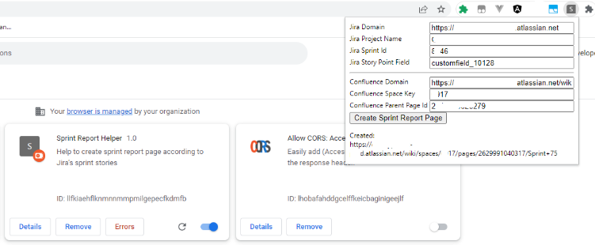
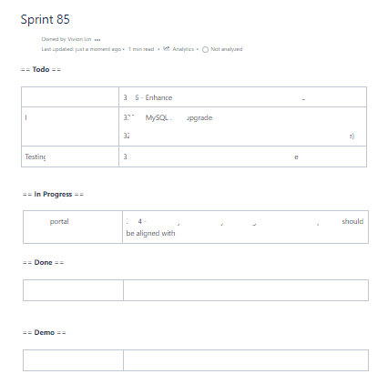

# jira-confluence-sprint-report-generator

[Jira Confluence Sprint Report Generator](https://github.com/VivionLin/jira-confluence-sprint-report-generator) is a Chrome browser extension for generating sprint report page automatically:

## How to use

1. download zip, unzip
2. add your Jira domain to the host_permissions in manifest.json
3. install the extension
  * Chrome → Extensions → Load unpacked
4. login to Jira and Confluence with your Chrome browser
5. click the extension, confirm the related input field values
  * your Jira root path
  * your project name
  * your story point field name
  * your confluence root path
  * your confluence space key
  * id of the page which you wish to be the parent of generated page
6. find the sprint id of your sprint, copy to 'Jira Sprint Id'
7. click 'Create Sprint Report Page'
8. wait for successful / failed alert
9. check the generated page

